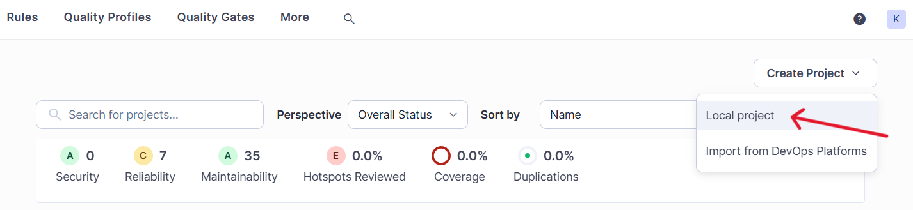
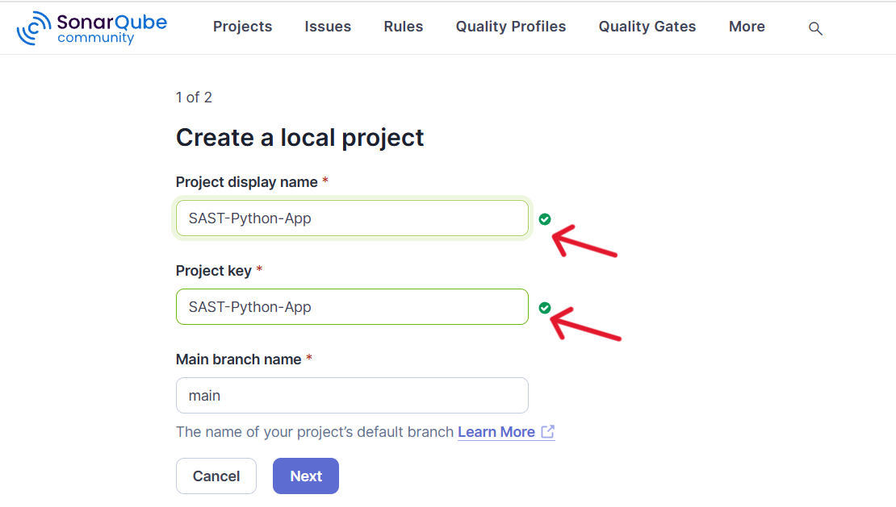
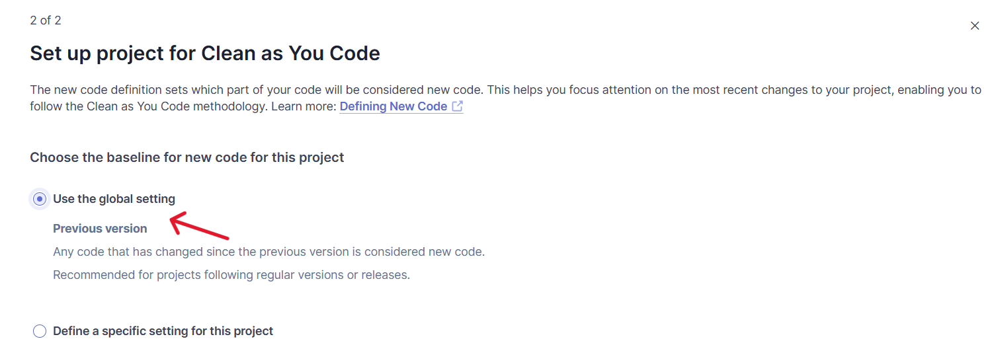
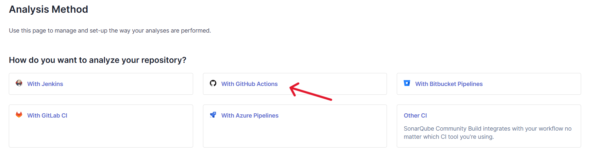
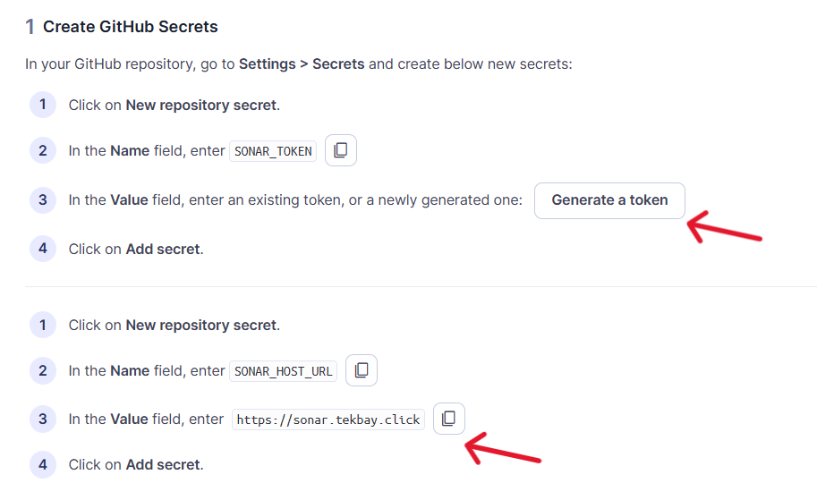
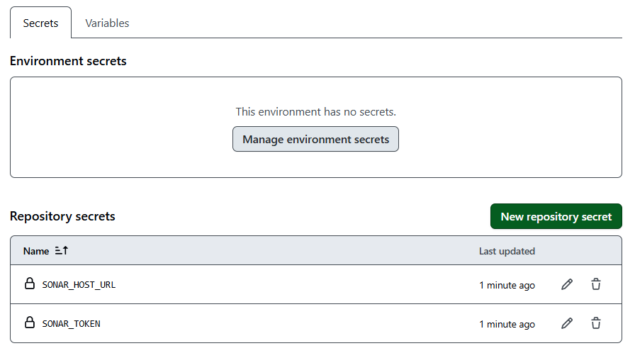
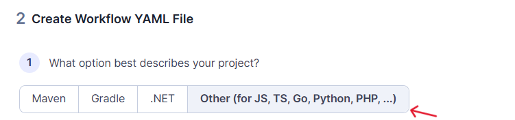
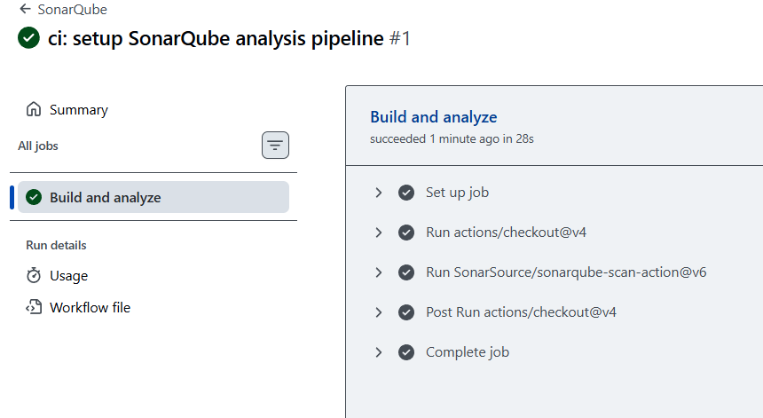
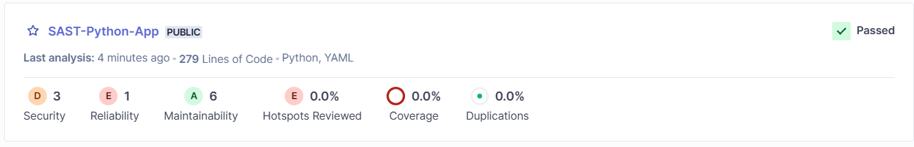

# SAST Implementation using SonarQube and GitHub Actions

This document outlines how to integrate `Static Application Security Testing`(SAST) into your DevSecOps workflow using `SonarQube`. SAST analyzes source code to identify vulnerabilities and code quality issues without `executing the application` — helping catch security flaws early in the development lifecycle.

`SonarQube` scans code for bugs, security vulnerabilities, code smells, and quality metrics, giving developers actionable insights during development.

---

## Part 1: SonarQube Project Configuration

### Step 1: Create a new local project

- Select **"Create a local project"** option



---

### Step 2: Enter project details

Fill in the required project information:

- **Project display name**: Enter a descriptive name for your project
- **Project key**: Provide a unique identifier for the project
- **Main branch name**: Specify your main branch (typically `main` or `master`)



---

**Note:** We need to create a file named `sonar-project.properties` in the `root` folder and fill in the values of the **Project Details**.
```
sonar.projectKey=SAST-Integration:-SonarQube-GitHub-Actions
sonar.projectName=SAST-Integration:-SonarQube-GitHub-Actions
sonar.sources=.

```

---

### Step 4: Configure analysis settings

When prompted for project settings:

1. Select **"Use the Global Setting"** option



---

### Step 5: Select analysis method

Choose how SonarQube will analyze your code:

1. From the available options, select **"GitHub Actions"**
2. This will enable automated code analysis through your CI/CD pipeline



---  

## Part 2: GitHub Repository Configuration

### Step 6: Navigate to repository secrets

To establish secure communication between GitHub and SonarQube, you need to configure repository secrets:

1. Go to your GitHub repository
2. Click on **Settings** (top menu bar)
3. In the left sidebar, navigate to **Secrets and variables** → **Actions**
4. Click the **"New repository secret"** button



---

### Step 7: Add SONAR_TOKEN Secret

1. Click **"New repository secret"**
2. In the **Name** field, enter: `SONAR_TOKEN`
3. In the **Value** field, paste your SonarQube authentication token
   - If you don't have a token, generate one from SonarQube: User Menu → My Account → Security → Generate Token
4. Click **"Add secret"** to save

### Step 8: Add SONAR_HOST_URL Secret

1. Click **"New repository secret"** again
2. In the **Name** field, enter: `SONAR_HOST_URL`
3. In the **Value** field, enter: `https://sonar.tekbay.click`
4. Click **"Add secret"** to save



> **Note**: Both secrets are now securely stored and will be accessible to your GitHub Actions workflows.

---

## Part 3: GitHub Actions Workflow Setup

### Step 9: Select project type

SonarQube provides different configurations based on project type. Choose the one that matches your project:

- **Maven** - For Java projects using Maven
- **Gradle** - For Java projects using Gradle
- **.NET** - For C# and .NET applications
- **Other** - For JavaScript, TypeScript, Go, Python, PHP, and other languages

For most non-Java projects, select **"Other"**.



---

### Step 10: Create a Workflow File

```yaml
name: SonarQube

on: [push]

jobs:
  build:
    name: Build and analyze
    runs-on: ubuntu-latest
    
    steps:
      - uses: actions/checkout@v4
        with:
          fetch-depth: 1  # Shallow clones should be disabled for a better relevancy of analysis
      - uses: SonarSource/sonarqube-scan-action@v6
        env:
          SONAR_TOKEN: ${{ secrets.SONAR_TOKEN }}
          SONAR_HOST_URL: ${{ secrets.SONAR_HOST_URL }}
      # If you wish to fail your job when the Quality Gate is red, uncomment the
      # following lines. This would typically be used to fail a deployment.
      # - uses: SonarSource/sonarqube-quality-gate-action@v1
      #   timeout-minutes: 5
      #   env:
      #     SONAR_TOKEN: ${{ secrets.SONAR_TOKEN }}
```
---

### Step 11: Commit and Push Changes

1. Navigate to the Actions tab in GitHub repository to monitor the workflow execution.



---

## Part 4: Reviewing Results

After the GitHub Actions workflow completes successfully, log in to your SonarQube instance to review the analysis results.



---


